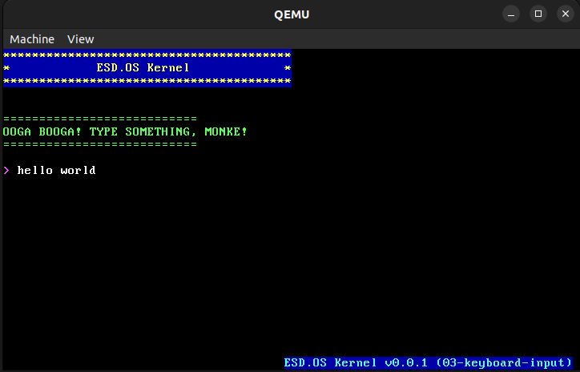

# ESD.OS

My own programming language, kernel, bootloader, operating system, graphics library, and applications.

## 🦍 Philosophy 🦍

OOGA BOOGA! ESD.OS is MONKE OS. No safetynet, no thinky-thinky, only CRASH! 🦧 U divide by zero? SYSTEM GO BONK. U touch NULL? REBOOT TIME, MONKE. No error, only PAIN and FUNNY. If u want safe, go banana elsewhere 🍌

Every keypress is DANGER. Every syscall is BIG MONKE GAMBLE. U mess up? U go back to jungle (reboot). Only giga-monke allowed, no baby chimp. U want learn OS? OOGA, prepare for BONK. U want run homework? HAHA, MONKE LAUGH AT U.

Remember: in ESD.OS, only handler is BIG RED BUTTON (RESET). Enjoy PAIN, monke style. OOGA BOOGA! 🦍🍌

## Roadmap & Prototypes

Development proceeds in small, focused prototypes, each adding a fundamental feature needed for a fully functional kernel. Each prototype is self-contained and demonstrates a single step in the evolution of the OS:

## Expanded Roadmap

### ESD.Kernel-0.0.1: Basic Boot & IO
- **01-simple-boot:** Minimal bootloader and kernel entry.
- **02-improved-console:** Basic console output improvements.
- **03-keyboard-input:** Basic PS/2 keyboard driver without complex mapping.

### ESD.Kernel-0.0.2: Core Kernel Features
- **04-memory-management:** Physical and virtual memory management. No memory protection!
- **05-interrupts-exceptions:** Full interrupt handling. When error, just CRASH BOOM!
- **06-multitasking:** Simple task switching. No fancy scheduling, just TAKE TURN OR DIE!

### ESD.Kernel-0.1.0: System Interfacing
- **07-userspace:** Ring 3 execution with minimal separation. The WALL between MONKE and MACHINE!
- **08-syscalls:** Raw system call interface. Give wrong parameters? SYSTEM ANGRY!
- **09-pci-driver:** PCI bus detection and enumeration. MONKE FIND COMPUTER PARTS!
- **10-disk-driver:** Basic IDE/SATA driver. No journaling! Data die? TOO BAD!
- **11-filesystem:** Simple filesystem implementation. DELETE button is DANGER button!

### ESD.Kernel-0.2.0: Graphical Interface
- **12-vesa-driver:** Basic VESA graphics. COLORFUL MONKE PICTURES!
- **13-mouse-support:** Mouse input and cursor. POINT AND CLICK, MONKE STYLE!
- **14-window-manager:** Ultra-minimal windowing system. Crash one app? ALL APPS GO BOOM!
- **15-gui-toolkit:** Simple GUI widgets. PRETTY BUTTONS FOR MONKE FINGERS!
- **16-terminal:** Terminal emulator for command execution. TYPE WRONG = COMPUTER ANGRY!

### ESD.Kernel-0.3.0: Network & Applications
- **17-networking:** TCP/IP stack with no security. PACKETS GO ZOOM, HACKERS WELCOME!
- **18-usb-support:** Basic USB device recognition. PLUG THING IN, MAYBE WORK MAYBE EXPLODE!
- **19-audio:** Simple audio driver. TOO LOUD? EARS BLEEDING? MONKE PROBLEM, NOT OS PROBLEM!
- **20-app-loader:** Load and execute binaries. BAD PROGRAM? WHOLE SYSTEM DIE!
- **21-text-editor:** Simple text editor. NO AUTOSAVE! POWER OUTAGE IS SKILL ISSUE!
- **22-browser:** Ultra minimal web browser. ALL WEBSITES TRUSTED! WHAT SECURITY?

### ESD.Kernel-1.0.0: Daily Driver
- **23-package-system:** Install/remove programs. BREAK DEPENDENCIES? SYSTEM GO POOF!
- **24-small-apps:** Calculator, image viewer, etc. DIVIDE BY ZERO? CALCULATOR EXPLODE!
- **25-device-hotplug:** Support for device hotplugging. WRONG DEVICE? KERNEL PANIC FOR YOU!
- **26-power-management:** Basic ACPI for power control. BATTERY MANAGEMENT? MORE LIKE BATTERY GAMBLING!
- **27-multi-user:** Multiple user support without real security. ALL USERS ARE ROOT! SHARE EVERYTHING!
- **28-bootloader:** Custom bootloader to replace GRUB. ONE WRONG BYTE = NO BOOT FOR YOU!